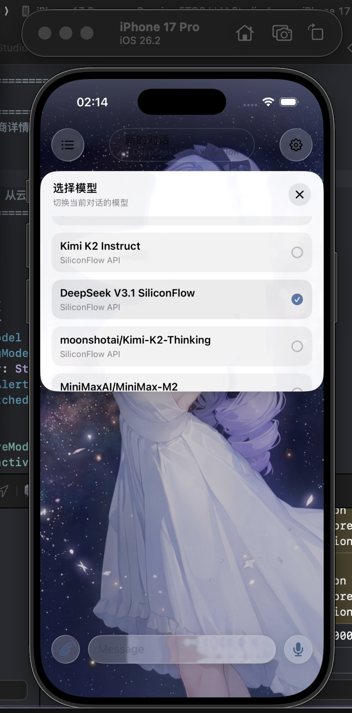

# ETOS LLM Studio (ELS)

## English

> **Spark of wisdom on your wrist, redefining the dimension of AI interaction.**

**ETOS LLM Studio (ELS)** is a flagship AI client explicitly tailored for **watchOS** and **iOS**. It is not merely a wrapper but an ultimate exploration of Apple's ecosystem interaction logic.

ELS condenses the powerful reasoning capabilities of LLMs (including DeepSeek) into a square inch with its minimalist yet profound rhythmic aesthetics. Whether in the rhythm of a morning jog or a fleeting moment of inspiration, simply raise your wrist, and profound thoughts and insights are within reach like a stream of light.

**Features:**
- **Watch-First Design**: Independent interaction experience built for Apple Watch.
- **Aesthetic UI**: Minimalist design with fluid animations and immersive typography.
- **Seamless Sync**: Perfect synergy between iOS and watchOS.
- **Deep Integration**: Native performance with haptic feedback.
- **Multi-Model Support**: Connect with various LLMs, including DeepSeek.

---

## 简体中文

> **穿梭于腕间的智慧灵光，重塑 AI 交互新维度。**

**ETOS LLM Studio (ELS)** 是一款专为 **watchOS** 与 **iOS** 深度定制的旗舰级 AI 客户端。它并非简单的接口套壳，而是对 Apple 生态交互逻辑的极致探索。

ELS 以其极简而深邃的律动美学，将大模型（支持 DeepSeek 等多种模型）磅礴的推理能力浓缩于方寸之间。无论是在晨间慢跑的律动中，还是在灵感迸发的瞬息，只需轻抬手腕，那些深邃的思想与洞见便如流光般触手可及。

**核心特性：**
- **腕上智核 (Watch-First Design)**: 专为 Apple Watch 打造的独立交互体验，无需依赖手机即可完成复杂的对话与推理。
- **极简美学 (Aesthetic UI)**: 摒弃繁杂，回归内容本身。流畅的动画与沉浸式的排版，让每一次对话都成为视觉享受。
- **全端联动 (Seamless Sync)**: iOS 与 watchOS 完美协同，随时随地接入强大的 AI 模型。
- **深度集成 (Deep Integration)**: 充分利用原生系统特性，提供如丝般顺滑的响应速度与触觉反馈。

---

## 日本語

> **手首で輝く知性の閃き、AIインタラクションの新たな次元へ。**

**ETOS LLM Studio (ELS)** は、**watchOS** と **iOS** のために特別に設計されたフラッグシップ AI クライアントです。単なるラッパーではなく、Apple エコシステムのインタラクションロジックを極限まで追求しました。

ELS はそのミニマルかつ深淵なリズムの美学により、DeepSeek を含む大規模言語モデル（LLM）の強大な推論能力をこの方寸の地に凝縮しました。朝のジョギングのリズムの中であれ、インスピレーションが湧いた瞬間の輝きであれ、手首を軽く上げるだけで、深遠な思考と洞察が流星のようにあなたの手に届きます。

**特徴：**
- **Watch-First Design**: Apple Watch のために構築された独立した対話体験。
- **Aesthetic UI**: 複雑さを排除し、コンテンツの本質へ。流れるようなアニメーションと没入感のあるタイポグラフィ。
- **Seamless Sync**: iOS と watchOS の完璧な連携。
- **Deep Integration**: ネイティブなパフォーマンスと触覚フィードバック。

---

## Preview

    
    

## Get it | 获取 | 入手

